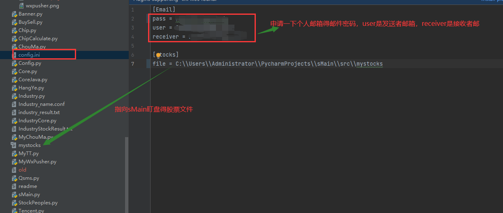
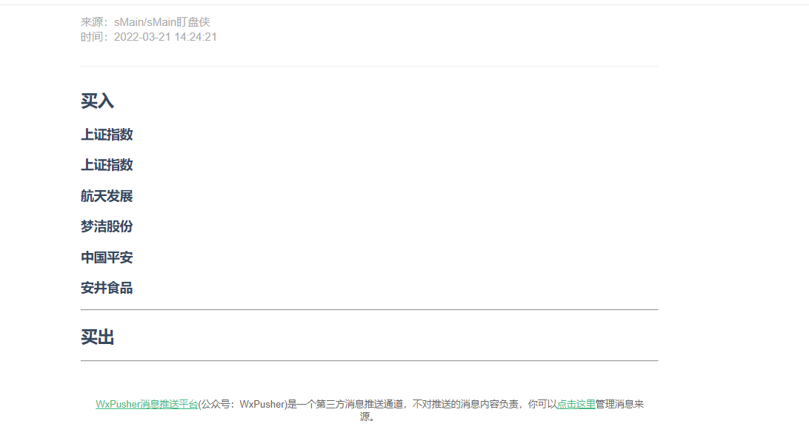

# sMain

- sMain 实时个股盯盘，交易信号邮件提醒，微信提醒，短信提醒，好望角，分水岭，一鼓作气，顶底指标。
# 使用方法
1. 申请自己邮箱得密钥，填写发送方和接收方得邮箱地址。
2. 在我们得mystocks文件中填写需要盯盘得股票信息。

* mystocks文件得编写格式：`股票代码,买入价格,买入数量,股票名称,0,0`

# 使用效果

## 1、邮件提醒

## 2、微信提醒

